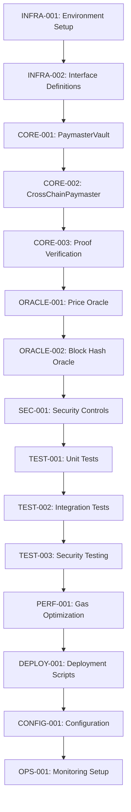

# Cross-Chain Paymaster Smart Contracts Implementation Tasks

**Project**: Cross-Chain Paymaster System  
**Generated**: January 2025  
**Status**: Implementation Ready

## Overview

Comprehensive task breakdown for implementing Cross-Chain Paymaster smart contracts enabling trustless USDC → ROSE bridging between Base and Oasis Sapphire chains.

## Task Categories

- **Infrastructure**: Development environment and tooling setup
- **Core Contracts**: Smart contract implementation
- **Integration**: External contract and oracle integration  
- **Security**: Security implementations and testing
- **Testing**: Comprehensive test suites
- **Deployment**: Multi-chain deployment and configuration

## Tasks

### Infrastructure Setup

```json
{
  "id": "INFRA-001",
  "title": "Development Environment Setup",
  "description": "Configure Hardhat development environment with multi-chain support, dependencies, and testing framework for Base and Sapphire networks.",
  "type": "infrastructure",
  "priority": "critical",
  "status": "completed",
  "dependencies": [],
  "subtasks": [
    {
      "id": "INFRA-001-01",
      "description": "Install and configure Hardhat with TypeScript",
      "status": "completed"
    },
    {
      "id": "INFRA-001-02", 
      "description": "Add OpenZeppelin Contracts v5.x dependencies",
      "status": "completed"
    },
    {
      "id": "INFRA-001-03",
      "description": "Configure Base mainnet fork for testing",
      "status": "completed"
    },
    {
      "id": "INFRA-001-04",
      "description": "Set up Sapphire testnet configuration",
      "status": "completed"
    },
    {
      "id": "INFRA-001-05",
      "description": "Install solidity-rlp package for RLP decoding",
      "status": "completed"
    }
  ],
  "acceptance_criteria": [
    "Hardhat compiles contracts successfully",
    "Both Base and Sapphire networks accessible", 
    "All dependencies resolve without conflicts",
    "TypeScript types generate correctly"
  ],
  "testing_requirements": "Environment validation script passes all checks",
  "estimated_hours": 8
}
```

```json
{
  "id": "INFRA-002",
  "title": "Contract Interface Definitions",
  "description": "Define all smart contract interfaces, events, and data structures with gas-optimized storage patterns.",
  "type": "infrastructure", 
  "priority": "high",
  "status": "completed",
  "dependencies": ["INFRA-001"],
  "subtasks": [
    {
      "id": "INFRA-002-01",
      "description": "Create IPaymasterVault interface with deposit function",
      "status": "completed"
    },
    {
      "id": "INFRA-002-02",
      "description": "Create ICrossChainPaymaster interface",
      "status": "completed"
    },
    {
      "id": "INFRA-002-03", 
      "description": "Define IROFLPriceOracle interface",
      "status": "completed"
    },
    {
      "id": "INFRA-002-04",
      "description": "Create gas-optimized data structures (DepositData, AssetConfig, ChainConfig)",
      "status": "completed"
    },
    {
      "id": "INFRA-002-05",
      "description": "Define comprehensive events with proper indexing",
      "status": "completed"
    }
  ],
  "acceptance_criteria": [
    "All interfaces compile successfully",
    "AssetConfig struct packed into single storage slot",
    "Events properly indexed for efficient querying",
    "Data structures support future extensibility"
  ],
  "testing_requirements": "Interface compilation and struct packing verification",
  "estimated_hours": 12
}
```

### Core Contract Implementation

```json
{
  "id": "CORE-001",
  "title": "PaymasterVault Implementation",
  "description": "Implement complete PaymasterVault contract for Base chain with deposit handling, asset management, and circuit breakers.",
  "type": "feature",
  "priority": "critical", 
  "status": "pending",
  "dependencies": ["INFRA-002"],
  "subtasks": [
    {
      "id": "CORE-001-01",
      "description": "Implement UUPS upgradeable contract skeleton",
      "status": "pending"
    },
    {
      "id": "CORE-001-02",
      "description": "Add deposit function with full validation logic",
      "status": "pending"
    },
    {
      "id": "CORE-001-03", 
      "description": "Implement asset configuration management (CRUD)",
      "status": "pending"
    },
    {
      "id": "CORE-001-04",
      "description": "Add unique deposit ID generation algorithm", 
      "status": "pending"
    },
    {
      "id": "CORE-001-05",
      "description": "Implement circuit breaker with daily volume limits",
      "status": "pending"
    },
    {
      "id": "CORE-001-06",
      "description": "Add comprehensive event emission",
      "status": "pending"
    }
  ],
  "acceptance_criteria": [
    "Deposit function processes valid USDC deposits",
    "Asset configuration enforces min/max amounts",
    "Daily limits prevent excessive volume",
    "Deposit IDs are unique and deterministic",
    "Events contain all required data for monitoring",
    "Reentrancy protection prevents attacks"
  ],
  "testing_requirements": "Unit tests for all functions, edge cases, and security scenarios",
  "estimated_hours": 24
}
```

```json
{
  "id": "CORE-002", 
  "title": "CrossChainPaymaster Implementation",
  "description": "Implement CrossChainPaymaster contract for Sapphire chain with proof verification and ROSE distribution.",
  "type": "feature",
  "priority": "critical",
  "status": "pending", 
  "dependencies": ["CORE-001"],
  "subtasks": [
    {
      "id": "CORE-002-01",
      "description": "Implement UUPS upgradeable contract skeleton",
      "status": "pending"
    },
    {
      "id": "CORE-002-02",
      "description": "Add chain configuration management system",
      "status": "pending"
    },
    {
      "id": "CORE-002-03",
      "description": "Implement ROSE distribution logic",
      "status": "pending"
    },
    {
      "id": "CORE-002-04",
      "description": "Add message execution framework with whitelisting",
      "status": "pending"
    },
    {
      "id": "CORE-002-05", 
      "description": "Implement duplicate deposit prevention",
      "status": "pending"
    },
    {
      "id": "CORE-002-06",
      "description": "Add role-based access control (Owner, ROFL Operator)",
      "status": "pending"
    }
  ],
  "acceptance_criteria": [
    "Processes deposits with valid proof data",
    "Distributes correct ROSE amounts to recipients", 
    "Executes messages on whitelisted targets only",
    "Prevents duplicate deposit processing",
    "Enforces role-based permissions correctly",
    "Circuit breaker limits daily ROSE distributions"
  ],
  "testing_requirements": "Unit tests for deposit processing, access control, and message execution",
  "estimated_hours": 20
}
```

```json
{
  "id": "CORE-003",
  "title": "Proof Verification Integration", 
  "description": "Integrate ProvethVerifier for Merkle Patricia Trie proof validation and event extraction from Base chain transactions.",
  "type": "feature",
  "priority": "critical",
  "status": "pending",
  "dependencies": ["CORE-002"],
  "subtasks": [
    {
      "id": "CORE-003-01",
      "description": "Integrate ProvethVerifier contract from liquefaction submodule",
      "status": "pending"
    },
    {
      "id": "CORE-003-02",
      "description": "Implement transaction inclusion verification logic",
      "status": "pending"
    },
    {
      "id": "CORE-003-03",
      "description": "Add RLP decoding for block headers and receipts",
      "status": "pending"
    },
    {
      "id": "CORE-003-04",
      "description": "Implement PaymasterDeposit event extraction and validation",
      "status": "pending"
    },
    {
      "id": "CORE-003-05",
      "description": "Add block hash verification against oracle",
      "status": "pending"
    },
    {
      "id": "CORE-003-06",
      "description": "Optimize gas consumption for proof verification",
      "status": "pending"
    }
  ],
  "acceptance_criteria": [
    "Valid Merkle proofs accepted and verified correctly",
    "Invalid proofs rejected with appropriate errors", 
    "PaymasterDeposit events extracted accurately from receipts",
    "Block hash validation prevents fake proofs",
    "Gas consumption under 250k for proof verification",
    "Chain ID validation prevents cross-chain replay attacks"
  ],
  "testing_requirements": "Comprehensive proof validation tests including malformed proofs and edge cases",
  "estimated_hours": 32
}
```

### Oracle Integration

```json
{
  "id": "ORACLE-001",
  "title": "Price Oracle Integration",
  "description": "Implement integration with ROFL price oracle for USDC/ROSE exchange rate calculations with staleness protection.",
  "type": "integration",
  "priority": "high",
  "status": "pending", 
  "dependencies": ["CORE-003"],
  "subtasks": [
    {
      "id": "ORACLE-001-01",
      "description": "Implement IROFLPriceOracle interface integration",
      "status": "pending"
    },
    {
      "id": "ORACLE-001-02", 
      "description": "Add price staleness validation (max 1 hour)",
      "status": "pending"
    },
    {
      "id": "ORACLE-001-03",
      "description": "Implement decimal precision handling for price calculations",
      "status": "pending"
    },
    {
      "id": "ORACLE-001-04",
      "description": "Add confidence score validation (min 80%)",
      "status": "pending"
    },
    {
      "id": "ORACLE-001-05", 
      "description": "Implement circuit breaker for oracle failures",
      "status": "pending"
    }
  ],
  "acceptance_criteria": [
    "USDC to ROSE conversion calculations accurate",
    "Stale prices rejected (older than 1 hour)",
    "Low confidence prices rejected (under 80%)",
    "Decimal precision handled correctly for different assets",
    "Oracle failures trigger appropriate fallback behavior"
  ],
  "testing_requirements": "Price calculation accuracy tests, staleness detection, and failure mode testing",
  "estimated_hours": 16
}
```

```json
{
  "id": "ORACLE-002",
  "title": "Block Hash Oracle Integration", 
  "description": "Integrate ITrivialBlockHashOracle for cross-chain block hash verification to validate proof authenticity.",
  "type": "integration",
  "priority": "high",
  "status": "pending",
  "dependencies": ["ORACLE-001"],
  "subtasks": [
    {
      "id": "ORACLE-002-01",
      "description": "Integrate ITrivialBlockHashOracle interface",
      "status": "pending"
    },
    {
      "id": "ORACLE-002-02",
      "description": "Add multi-chain block hash validation",
      "status": "pending"
    },
    {
      "id": "ORACLE-002-03",
      "description": "Implement block hash freshness checks",
      "status": "pending"
    },
    {
      "id": "ORACLE-002-04", 
      "description": "Add fallback handling for missing block hashes",
      "status": "pending"
    }
  ],
  "acceptance_criteria": [
    "Block hashes validated against oracle data",
    "Multiple chain IDs supported correctly", 
    "Missing block hashes handled gracefully",
    "Block hash freshness prevents old proof replay"
  ],
  "testing_requirements": "Block hash validation tests and missing data scenarios",
  "estimated_hours": 12
}
```

### Security Implementation

```json
{
  "id": "SEC-001",
  "title": "Comprehensive Security Controls",
  "description": "Implement all security mechanisms including circuit breakers, access controls, and attack prevention.",
  "type": "security",
  "priority": "critical",
  "status": "pending",
  "dependencies": ["ORACLE-002"],
  "subtasks": [
    {
      "id": "SEC-001-01",
      "description": "Implement robust circuit breakers with automatic daily resets",
      "status": "pending"
    },
    {
      "id": "SEC-001-02",
      "description": "Add comprehensive access control validation",
      "status": "pending"
    },
    {
      "id": "SEC-001-03",
      "description": "Validate reentrancy protection on all functions",
      "status": "pending"
    },
    {
      "id": "SEC-001-04",
      "description": "Add integer overflow/underflow protection",
      "status": "pending"
    },
    {
      "id": "SEC-001-05",
      "description": "Implement emergency pause mechanisms",
      "status": "pending"
    },
    {
      "id": "SEC-001-06",
      "description": "Add time manipulation attack prevention",
      "status": "pending"
    }
  ],
  "acceptance_criteria": [
    "Daily volume limits enforced with automatic resets",
    "All role-based permissions working correctly",
    "Reentrancy attacks prevented on all functions",
    "Integer arithmetic safe from overflow/underflow",
    "Emergency pause stops all operations immediately",
    "Time-dependent operations resistant to manipulation"
  ],
  "testing_requirements": "Security penetration testing, attack simulation, and edge case validation",
  "estimated_hours": 28
}
```

### Testing Implementation

```json
{
  "id": "TEST-001",
  "title": "Unit Test Suite",
  "description": "Implement comprehensive unit tests achieving 95%+ coverage with focus on security and edge cases.",
  "type": "test",
  "priority": "critical", 
  "status": "pending",
  "dependencies": ["SEC-001"],
  "subtasks": [
    {
      "id": "TEST-001-01",
      "description": "Create PaymasterVault unit tests (deposit, asset config, circuit breaker)",
      "status": "pending"
    },
    {
      "id": "TEST-001-02",
      "description": "Create CrossChainPaymaster unit tests (proof verification, ROSE distribution)",
      "status": "pending"
    },
    {
      "id": "TEST-001-03",
      "description": "Add oracle integration unit tests with mock implementations",
      "status": "pending"
    },
    {
      "id": "TEST-001-04",
      "description": "Create security test cases (reentrancy, access control, overflow)",
      "status": "pending"
    },
    {
      "id": "TEST-001-05",
      "description": "Add edge case and boundary condition tests",
      "status": "pending"
    },
    {
      "id": "TEST-001-06",
      "description": "Implement gas consumption measurement tests",
      "status": "pending"
    }
  ],
  "acceptance_criteria": [
    "95%+ code coverage achieved across all contracts",
    "All public functions have positive and negative test cases",
    "Security vulnerabilities tested and prevented",
    "Edge cases and boundary conditions covered",
    "Gas consumption within specified limits",
    "Mock implementations provide realistic behavior"
  ],
  "testing_requirements": "Full test suite execution with coverage reporting",
  "estimated_hours": 32
}
```

```json
{
  "id": "TEST-002",
  "title": "Integration Test Suite",
  "description": "Implement end-to-end integration tests covering complete cross-chain workflows and multi-contract interactions.",
  "type": "test", 
  "priority": "high",
  "status": "pending",
  "dependencies": ["TEST-001"],
  "subtasks": [
    {
      "id": "TEST-002-01",
      "description": "Create end-to-end deposit flow tests (USDC → ROSE)",
      "status": "pending"
    },
    {
      "id": "TEST-002-02",
      "description": "Add multi-deposit scenario testing",
      "status": "pending"
    },
    {
      "id": "TEST-002-03",
      "description": "Implement message execution integration tests",
      "status": "pending"
    },
    {
      "id": "TEST-002-04",
      "description": "Add oracle integration and failure scenario tests", 
      "status": "pending"
    },
    {
      "id": "TEST-002-05",
      "description": "Create circuit breaker activation tests",
      "status": "pending"
    }
  ],
  "acceptance_criteria": [
    "Complete deposit workflow executes successfully",
    "Multiple simultaneous deposits handled correctly",
    "Message execution works with various payloads",
    "Oracle failures handled gracefully without system failure",
    "Circuit breakers activate at correct thresholds"
  ],
  "testing_requirements": "End-to-end workflow validation with realistic scenarios",
  "estimated_hours": 28
}
```

```json
{
  "id": "TEST-003", 
  "title": "Security Testing & Fuzzing",
  "description": "Comprehensive security testing including fuzzing, penetration testing, and economic attack simulations.",
  "type": "security",
  "priority": "critical",
  "status": "pending",
  "dependencies": ["TEST-002"], 
  "subtasks": [
    {
      "id": "TEST-003-01",
      "description": "Implement fuzzing tests for all critical functions",
      "status": "pending"
    },
    {
      "id": "TEST-003-02",
      "description": "Create reentrancy attack simulation tests",
      "status": "pending"
    },
    {
      "id": "TEST-003-03",
      "description": "Add access control penetration tests",
      "status": "pending"
    },
    {
      "id": "TEST-003-04",
      "description": "Implement economic attack scenario testing",
      "status": "pending"
    },
    {
      "id": "TEST-003-05",
      "description": "Add oracle manipulation resistance testing",
      "status": "pending"
    },
    {
      "id": "TEST-003-06",
      "description": "Create DoS attack resistance tests",
      "status": "pending"
    }
  ],
  "acceptance_criteria": [
    "All fuzzing tests pass without finding vulnerabilities",
    "Reentrancy attacks successfully prevented",
    "Access control cannot be bypassed",
    "Economic attacks do not result in losses",
    "Oracle manipulation attempts fail",
    "DoS attacks cannot disable system functionality"
  ],
  "testing_requirements": "Comprehensive security test suite with attack simulation",
  "estimated_hours": 36
}
```

### Performance Optimization

```json
{
  "id": "PERF-001",
  "title": "Gas Optimization Implementation",
  "description": "Optimize all contracts for gas efficiency while maintaining security and functionality.",
  "type": "performance",
  "priority": "high", 
  "status": "pending",
  "dependencies": ["TEST-003"],
  "subtasks": [
    {
      "id": "PERF-001-01",
      "description": "Optimize storage patterns and struct packing",
      "status": "pending"
    },
    {
      "id": "PERF-001-02",
      "description": "Implement assembly optimizations for critical paths",
      "status": "pending"
    },
    {
      "id": "PERF-001-03",
      "description": "Optimize proof verification gas consumption",
      "status": "pending"
    },
    {
      "id": "PERF-001-04",
      "description": "Minimize event emission gas costs",
      "status": "pending"
    },
    {
      "id": "PERF-001-05",
      "description": "Implement short-circuit evaluation for validations",
      "status": "pending"
    }
  ],
  "acceptance_criteria": [
    "Deposit function consumes <120k gas",
    "Proof verification consumes <250k gas", 
    "Total end-to-end flow consumes <600k gas",
    "Storage access patterns optimized for efficiency",
    "No performance regressions introduced"
  ],
  "testing_requirements": "Gas benchmark tests and performance regression testing",
  "estimated_hours": 24
}
```

### Deployment Infrastructure

```json
{
  "id": "DEPLOY-001",
  "title": "Multi-Chain Deployment Scripts",
  "description": "Create robust deployment scripts for Base and Sapphire networks with UUPS proxy pattern and verification.",
  "type": "infrastructure",
  "priority": "high",
  "status": "pending",
  "dependencies": ["PERF-001"],
  "subtasks": [
    {
      "id": "DEPLOY-001-01", 
      "description": "Create Base chain deployment script for PaymasterVault",
      "status": "pending"
    },
    {
      "id": "DEPLOY-001-02",
      "description": "Create Sapphire chain deployment script for CrossChainPaymaster",
      "status": "pending"
    },
    {
      "id": "DEPLOY-001-03",
      "description": "Implement UUPS proxy deployment and initialization",
      "status": "pending"
    },
    {
      "id": "DEPLOY-001-04",
      "description": "Add contract verification automation",
      "status": "pending"
    },
    {
      "id": "DEPLOY-001-05",
      "description": "Create deployment validation and testing scripts",
      "status": "pending"
    }
  ],
  "acceptance_criteria": [
    "Deployment scripts execute successfully on testnets",
    "UUPS proxies deploy and initialize correctly",
    "All contracts verified on block explorers",
    "Deployment validation confirms correct configuration",
    "Rollback procedures available for failed deployments"
  ],
  "testing_requirements": "Testnet deployment validation and verification testing",
  "estimated_hours": 20
}
```

```json
{
  "id": "CONFIG-001",
  "title": "Production Configuration & Initialization",
  "description": "Configure all deployed contracts with production parameters and establish cross-chain connectivity.",
  "type": "infrastructure",
  "priority": "critical",
  "status": "pending", 
  "dependencies": ["DEPLOY-001"],
  "subtasks": [
    {
      "id": "CONFIG-001-01",
      "description": "Configure USDC asset on PaymasterVault with production parameters",
      "status": "pending"
    },
    {
      "id": "CONFIG-001-02",
      "description": "Set Base chain configuration on CrossChainPaymaster",
      "status": "pending"
    },
    {
      "id": "CONFIG-001-03",
      "description": "Configure ROFL price oracle address",
      "status": "pending"
    },
    {
      "id": "CONFIG-001-04", 
      "description": "Set block hash oracle address",
      "status": "pending"
    },
    {
      "id": "CONFIG-001-05",
      "description": "Configure ROFL operator permissions",
      "status": "pending"
    },
    {
      "id": "CONFIG-001-06",
      "description": "Set daily limits and circuit breaker parameters",
      "status": "pending"
    },
    {
      "id": "CONFIG-001-07",
      "description": "Fund CrossChainPaymaster with initial ROSE reserves",
      "status": "pending"
    }
  ],
  "acceptance_criteria": [
    "USDC configuration accepts $10-$10k deposits",
    "Base chain configuration allows proof processing",
    "Oracle addresses set and connectivity verified",
    "ROFL operator can process deposits",
    "Daily limits configured appropriately",
    "Initial ROSE funding sufficient for operations"
  ],
  "testing_requirements": "Configuration validation and connectivity testing",
  "estimated_hours": 16
}
```

### Operations & Monitoring

```json
{
  "id": "OPS-001",
  "title": "Monitoring & Operations Setup",
  "description": "Establish comprehensive monitoring, alerting, and operational procedures for production system.",
  "type": "infrastructure", 
  "priority": "high",
  "status": "pending",
  "dependencies": ["CONFIG-001"],
  "subtasks": [
    {
      "id": "OPS-001-01",
      "description": "Set up event monitoring and indexing system",
      "status": "pending"
    },
    {
      "id": "OPS-001-02",
      "description": "Configure alerting thresholds and notifications",
      "status": "pending"
    },
    {
      "id": "OPS-001-03",
      "description": "Create operational dashboard with key metrics",
      "status": "pending"
    },
    {
      "id": "OPS-001-04",
      "description": "Document emergency response procedures",
      "status": "pending"
    },
    {
      "id": "OPS-001-05",
      "description": "Create operational runbooks for routine maintenance",
      "status": "pending"
    }
  ],
  "acceptance_criteria": [
    "All critical events monitored and indexed",
    "Alert notifications working for threshold violations",
    "Dashboard displays real-time system metrics",
    "Emergency procedures documented and tested",
    "Operational runbooks complete and accessible"
  ],
  "testing_requirements": "Monitoring system validation and alert testing",
  "estimated_hours": 18
}
```

## Task Dependencies



## Critical Path Analysis

**Total Duration**: 10 weeks  
**Critical Path**: INFRA-001 → INFRA-002 → CORE-001 → CORE-002 → CORE-003 → SEC-001 → TEST-003 → DEPLOY-001 → CONFIG-001

**High-Risk Tasks**:
- CORE-003: Proof Verification Integration (32 hours) - Most complex component
- TEST-003: Security Testing & Fuzzing (36 hours) - Critical for production readiness
- SEC-001: Security Controls (28 hours) - Essential for safe operations

## Success Metrics

### Functional Requirements
- [ ] 100% proof verification accuracy
- [ ] Zero duplicate deposits processed  
- [ ] <1% message execution failure rate
- [ ] 99.9% system uptime

### Performance Requirements
- [ ] Deposit processing: <120k gas
- [ ] Proof verification: <250k gas
- [ ] Total end-to-end: <600k gas
- [ ] Processing time: <30 seconds

### Security Requirements
- [ ] Zero security incidents
- [ ] 95%+ test coverage achieved
- [ ] All access controls enforced
- [ ] Circuit breakers functional

### Quality Requirements
- [ ] All contracts verified on explorers
- [ ] Complete documentation delivered
- [ ] Operational procedures established
- [ ] Monitoring system operational

---

**Status**: ✅ Ready for Implementation  
**Estimated Total Effort**: 352 hours (10 weeks)  
**Risk Level**: Medium (complex proof verification and security requirements)